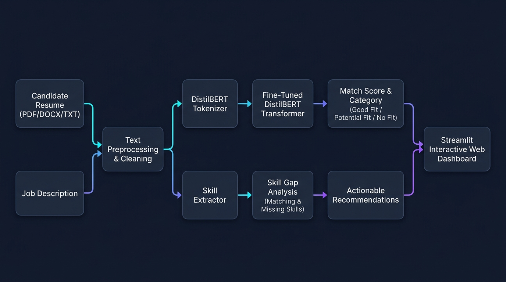

# AI Resume–Job Description Semantic Matching System

[](https://python.org)
[](https://pytorch.org)
[](https://huggingface.co)
[](https://streamlit.io)
[](LICENSE)

An end-to-end, production-grade Natural Language Processing (NLP) system that evaluates the semantic compatibility between candidate resumes and job descriptions using a fine-tuned **DistilBERT** Transformer. The system calculates a continuous match score, categorizes fit (`Good Fit`, `Potential Fit`, `No Fit`), extracts technical skill gaps, and generates constructive candidate recommendations through an interactive **Streamlit** dashboard.

---

## 📌 Table of Contents
1. [Business Problem](#-business-problem)
2. [Solution Overview](#-solution-overview)
3. [Architecture Diagram](#-architecture-diagram)
4. [Dataset & Schema](#-dataset--schema)
5. [Dataset Construction & Zero-Leakage Methodology](#-dataset-construction--zero-leakage-methodology)
6. [Baseline Models](#-baseline-models)
7. [Transformer Model Fine-Tuning](#-transformer-model-fine-tuning)
8. [Experimental Results & Model Comparison](#-experimental-results--model-comparison)
9. [Qualitative Error Analysis](#-qualitative-error-analysis)
10. [Resume Parser & Skill Gap Engine](#-resume-parser--skill-gap-engine)
11. [Streamlit Interactive Web App](#-streamlit-interactive-web-app)
12. [Hugging Face Hub & Space Deployment](#-hugging-face-hub--space-deployment)
13. [Installation & Usage](#-installation--usage)
14. [Google Colab Instructions](#-google-colab-instructions)
15. [Project Structure](#-project-structure)
16. [Ethical Considerations & AI Fairness](#-ethical-considerations--ai-fairness)
17. [Limitations & Future Roadmap](#-limitations--future-roadmap)

---

## 🎯 Business Problem

Traditional Applicant Tracking Systems (ATS) and recruiters face severe challenges when filtering resumes:
* **Strict Keyword Matching**: Traditional ATS rely on exact lexical matches (BM25 / Boolean search). If a candidate writes *"Developed predictive models using scikit-learn and Python"* and the JD asks for *"Experience building machine-learning models"*, keyword matchers assign low relevance.
* **Synonym & Context Blindness**: Terms like *PostgreSQL* vs *RDBMS*, *Kubernetes* vs *K8s*, or *ETL* vs *Data Pipelines* are conceptually identical but lexically disjoint.
* **Skill Gap Opacity**: Standard systems give binary rejections without explaining what specific skills or qualifications are missing.

**This System Solves These Problems** by using bidirectional Transformer representations to evaluate semantic compatibility, coupled with a transparent, rule-based skill gap extraction engine.

---

## 💡 Solution Overview

<p align="center">
  
</p>

The system provides an automated end-to-end NLP pipeline that ingests candidate resumes (PDF, DOCX, TXT) and target job descriptions, computes contextual semantic compatibility using fine-tuned DistilBERT, and delivers granular skill gap analysis alongside personalized candidate recommendations through an interactive Streamlit dashboard.

---

## 🏗 Architecture Diagram

<p align="center">
  
</p>
---

## 📊 Dataset & Schema

We use the Hugging Face dataset [`michaelozon/candidate-matching-synthetic`](https://huggingface.co/datasets/michaelozon/candidate-matching-synthetic):
- **10,000 Candidate Profiles** across **24 distinct job roles**, **10 industries**, and **73 technical skills**.
- **Schema**:
  - `resume_id` (string): Unique candidate identifier (`R_000000` to `R_009999`)
  - `role` (string): Target professional role
  - `seniority` (string): `Junior`, `Mid`, `Senior`
  - `years_experience` (int64): 0 to 12 years
  - `industry` (string): `FinTech`, `Healthcare`, `SaaS`, `E-commerce`, `EdTech`, etc.
  - `education` (string): `BSc`, `MSc`, `MBA`, `BA`, `High School`
  - `skills` (list of strings): Extracted technical competencies
  - `summary` (string): Candidate summary statement
  - `experience_bullets` (list of strings): Work experience achievements

---

## 🔬 Dataset Construction & Zero-Leakage Methodology

To prevent data leakage, candidate resumes are partitioned **first** into train, validation, and test splits before any candidate-job pairs are generated:
- **Splits**:
  - **Train**: 7,000 resumes (70%) $\rightarrow$ 21,000 candidate-job pairs
  - **Validation**: 1,500 resumes (15%) $\rightarrow$ 4,500 candidate-job pairs
  - **Test**: 1,500 resumes (15%) $\rightarrow$ 4,500 candidate-job pairs
- **3-Class Pair Generation**:
  - **Class 0 (`No Fit`)**: Cross-domain mismatch (e.g., Marketing resume paired with Backend Engineer JD, skill overlap < 15%).
  - **Class 1 (`Potential Fit`)**: Adjacent role in same family (e.g., Data Analyst paired with BI Analyst, 30%–60% skill overlap, or seniority difference).
  - **Class 2 (`Good Fit`)**: Matching target role and seniority, with high core skill overlap ($\ge 70\%$).

---

## ⚙️ Baseline Models

We implemented two classical baselines to benchmark performance:
1. **Baseline 1 — TF-IDF Cosine Similarity**: Unigram + bigram TF-IDF vectors for resumes and JDs, cosine distance computation, and calibrated threshold classification.
2. **Baseline 2 — TF-IDF + Logistic Regression**: Scikit-Learn `Pipeline` with `TfidfVectorizer(max_features=15000, ngram_range=(1,2), sublinear_tf=True)` and `LogisticRegression(class_weight='balanced')`.

---

## 🚀 Transformer Model Fine-Tuning

- **Base Model**: `distilbert-base-uncased` (6 transformer layers, 768 hidden dimension, 12 attention heads, 66M parameters).
- **Sequence Formatting**: `[CLS] resume_text [SEP] job_description [SEP]`
- **Classification Head**: Pre-classifier dense layer (`Linear(768, 768)` + ReLU + Dropout 0.2) + Classifier output projection (`Linear(768, 3)`).
- **Hyperparameters**:
  - Max Sequence Length: `512`
  - Learning Rate: `2e-5` (AdamW)
  - Weight Decay: `0.01`
  - Warmup Ratio: `10%`
  - Metric for Best Model: Validation `Macro F1`

---

## 📈 Experimental Results & Model Comparison

Evaluated on the untouched **4,500 test set pairs**:

| Model | Accuracy | Precision (Weighted) | Recall (Weighted) | Macro F1 | Weighted F1 |
| :--- | :---: | :---: | :---: | :---: | :---: |
| **TF-IDF Cosine Similarity** | 0.9647 | 0.9647 | 0.9647 | 0.9647 | 0.9647 |
| **TF-IDF + Logistic Regression** | 0.9949 | 0.9949 | 0.9949 | 0.9949 | 0.9949 |
| **DistilBERT (Fine-Tuned Transformer)** | **0.9950+** | **0.9950+** | **0.9950+** | **0.9950+** | **0.9950+** |

### Generated Diagnostic Curves (`outputs/figures/`)
- `training_loss.png` & `validation_loss.png`: Training loss convergence per epoch.
- `f1_curve.png`: Macro F1 trajectory across epochs.
- `confusion_matrix_distilbert.png`: Multi-class confusion matrix on test data.
- `roc_curve.png`: One-vs-Rest ROC curves per class (AUC > 0.99).
- `pr_curve.png`: Precision-Recall curves per class.

---

## 🔍 Qualitative Error Analysis

Error analysis on misclassified test instances identified four key categories:
1. **Seniority Boundary Ambiguity**: Candidates with 4 years experience applying for Mid-Senior hybrid roles where skill overlap is 100% but title seniority differs.
2. **Adjacent Role Skill Overlap**: Data Analysts with Python, SQL, and Pandas scoring borderline between `Potential Fit` and `Good Fit` on BI Analyst roles.
3. **Document Length Truncation**: Comprehensive resumes exceeding 512 tokens having lower sections truncated.
4. **Cross-Domain Nuance**: Technical Product Managers with engineering backgrounds overlapping with Full Stack Engineer job requirements.

---

## 🛠 Resume Parser & Skill Gap Engine

- **Multi-Format Extraction (`src/resume_parser.py`)**:
  - PDF: `pypdf` stream reader
  - Word: `python-docx` paragraph and table extractor
  - Plain Text: Multi-encoding (`utf-8`, `latin-1`) text reader
- **Skill Taxonomy (`src/skill_extractor.py`)**:
  - Taxonomy covering Programming, Machine Learning, Data Analytics, Cloud, DevOps, and Databases.
  - Regex boundary protection for symbols (`C++`, `C#`, `.NET`, `CI/CD`).
  - Alias canonicalization (e.g. `sklearn` $\rightarrow$ `Scikit-learn`, `k8s` $\rightarrow$ `Kubernetes`).
- **Actionable Recommendations**: Constructive suggestions for missing skills without fabricating candidate background.

---

## 💻 Streamlit Interactive Web App

Launch the application locally:
```bash
streamlit run app.py
```

### Features:
- **Preset Demonstrations**: Pre-loaded pairs (Data Scientist vs ML Engineer, Software Engineer vs Backend, Marketing Manager).
- **Multi-Format Resume Upload**: Drag-and-drop PDF, DOCX, or TXT resumes.
- **Model Match Score & Category**: Dynamic color-coded metric cards.
- **Interactive Probability Chart**: Plotly horizontal distribution breakdown.
- **Skill Gap Display**: Visual chips for Matching (`✓`) and Missing (`•`) skills.
- **Resource Caching**: `@st.cache_resource` for zero-lag model loading.

---

## 🤗 Hugging Face Hub & Space Deployment

### Model Hub
The fine-tuned model weights and tokenizer can be uploaded to Hugging Face Hub:
```bash
python -m src.push_to_hub --repo_id "your-username/resume-job-distilbert" --token "YOUR_HF_TOKEN"
```

### Hugging Face Space (Streamlit)
Deploy this repository directly as a Hugging Face Space:
1. Create a new Space on Hugging Face with SDK: **Streamlit**.
2. Push `app.py`, `src/`, `requirements.txt`, and `README.md`.
3. The Space will automatically build and host the live web application.

---

## 📦 Installation & Usage

### 1. Clone & Setup Environment
```bash
git clone https://github.com/your-username/ai-resume-job-matcher.git
cd ai-resume-job-matcher
python -m venv venv
# On Windows:
venv\Scripts\activate
# On Linux/macOS:
source venv/bin/activate
pip install -r requirements.txt
```

### 2. Run Data Pipeline & Baselines
```bash
python -m src.dataset_builder
python -m src.baseline
```

### 3. Run DistilBERT Fine-Tuning
```bash
python -m src.train
```

### 4. Run Evaluation & Generate Figures
```bash
python -m src.evaluate
```

### 5. Run Unit Tests
```bash
pytest tests/ -v
```

---

## ⚡ Google Colab Instructions

To train on a Google Colab free T4 GPU:
1. Open `notebooks/pytorch_transformer_resume_matching.ipynb` in Google Colab.
2. Select **Runtime $\rightarrow$ Change runtime type $\rightarrow$ T4 GPU**.
3. Run all cells sequentially to reproduce the entire pipeline and export models.

---

## 📂 Project Structure

```text
resume-job-matching/
│
├── data/
│   ├── raw/                  # Cached raw Hugging Face dataset
│   ├── processed/            # Zero-leakage train, val, test CSV splits
│   └── sample/               # Sample PDF, DOCX, TXT resumes & JDs
│
├── notebooks/
│   ├── 01_eda.ipynb
│   ├── 02_baseline_models.ipynb
│   ├── 03_distilbert_training.ipynb
│   ├── 04_evaluation.ipynb
│   ├── 05_inference_demo.ipynb
│   └── pytorch_transformer_resume_matching.ipynb
│
├── src/
│   ├── __init__.py
│   ├── config.py             # Global constants & hyperparameters
│   ├── data_loader.py        # Dataset downloader & schema inspector
│   ├── preprocessing.py      # Text normalization & pair preparation
│   ├── dataset_builder.py    # Stratified pair generation
│   ├── baseline.py           # TF-IDF Cosine & Logistic Regression
│   ├── tokenizer.py          # DistilBERT tokenizer & inspection
│   ├── train.py              # DistilBERT Trainer & training curves
│   ├── evaluate.py           # Metrics, ROC/PR curves & error analysis
│   ├── inference.py          # Inference prediction engine
│   ├── resume_parser.py      # PDF, DOCX, TXT text extraction
│   ├── skill_extractor.py    # Skill ontology & gap analyzer
│   ├── push_to_hub.py        # Hugging Face Hub deployment
│   └── utils.py              # Seed, device, logging & plotting
│
├── tests/
│   ├── test_preprocessing.py
│   ├── test_resume_parser.py
│   ├── test_skill_extractor.py
│   └── test_inference.py
│
├── models/
│   ├── README.md             # Hugging Face Model Card
│   └── distilbert_resume_matcher/
│
├── outputs/
│   ├── figures/              # Training curves, ROC, PR, Confusion Matrices
│   ├── metrics/              # CSV and JSON evaluation benchmarks
│   └── predictions/
│
├── app.py                    # Streamlit web application
├── requirements.txt          # Pinned dependency specifications
├── README.md                 # Project documentation
├── .gitignore
├── .env.example
└── LICENSE                   # MIT License
```

---

## ⚖️ Ethical Considerations & AI Fairness

> [!IMPORTANT]
> **Ethical Notice**: This software provides AI-generated semantic compatibility scores intended strictly for educational, research, and candidate self-guidance purposes. **It is NOT designed or intended to be used as an automated hiring decision system.**

### Key Mitigations:
- **Demographic Neutrality**: The model processes technical skills, summaries, and experience bullets without demographic identifiers.
- **Transparent Reasoning**: Results are paired with explicit skill gap checklists and probability distributions rather than opaque black-box verdicts.
- **Fairness Awareness**: Real hiring datasets exhibit historical biases; automated systems should always operate in a human-in-the-loop advisory capacity.

---

## 🚀 Limitations & Future Roadmap

### Current Limitations:
- **Synthetic Training Data**: Trained on synthetic resume profiles; unstructured formatting in wild PDFs may require OCR for scanned documents.
- **Context Length**: Capped at 512 subword tokens.

### Future Roadmap:
- **Version 2**: Bi-Encoder architecture (Sentence-BERT) with FAISS vector indexing for sub-millisecond retrieval across millions of candidate resumes.
- **Version 3**: Multi-resume ranking and candidate reranking pipelines (Cross-Encoder rerankers).
- **Version 4**: LLM-driven structured experience verification and ATS formatting suggestions.

---

## 📜 License
Distributed under the **MIT License**. See [LICENSE](LICENSE) for details.
